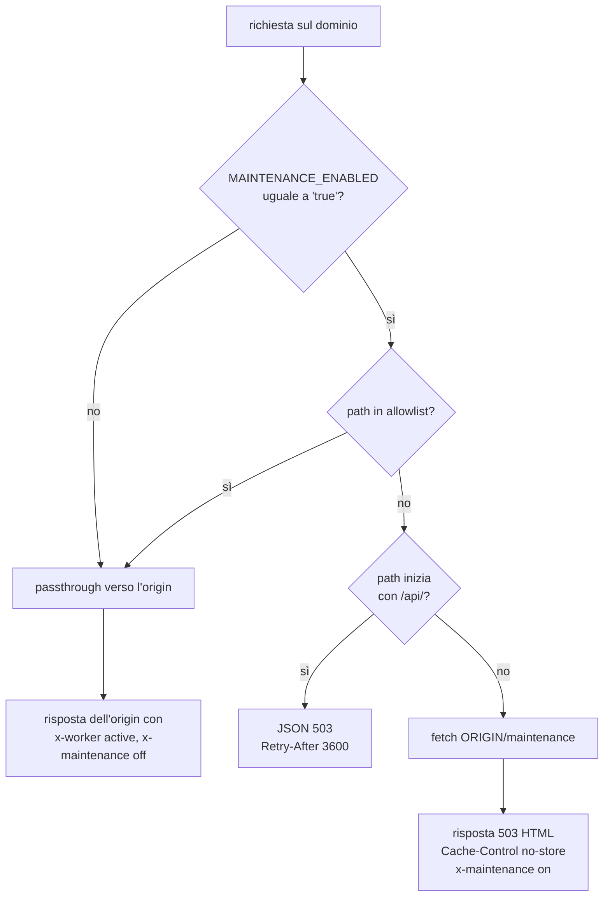

# Maintenance Mode Worker

Cloudflare Worker davanti a vetreriamonferrina.com. Fa due cose: la modalità manutenzione e l'origin lockdown. Il codice sta in `src/index.ts`, la configurazione in `wrangler.toml`.

Le route in `wrangler.toml` intercettano tutto il traffico di `vetreriamonferrina.com/*` e `www.vetreriamonferrina.com/*`. L'origin è la costante `ORIGIN` nel sorgente, oggi `https://vetreriamonferrina.vercel.app`: cambiare progetto Vercel significa modificare quella riga.

## Il percorso di una richiesta

Qualunque eccezione nel `fetch` viene catturata e produce un 502 di testo con `Retry-After: 60`.

## Il passthrough non è trasparente

Quando la manutenzione è spenta il worker inoltra la richiesta all'origin, ma la modifica in cinque punti.

Sulla richiesta in uscita imposta l'header `x-origin-verify` con `ORIGIN_VERIFY_SECRET`, usando `.set()` e non `.append()`, così un valore falso mandato dal client viene sovrascritto. Usa `redirect: 'manual'`, perché i 3xx dell'origin (trailing slash, sitemap, vecchi `/images/*`) devono arrivare al client come redirect veri invece che mascherati da 200.

Sulla risposta riscrive l'header `Location` quando punta all'origin Vercel, sostituendolo con l'host pubblico richiesto dal client: il confronto è fatto sull'origin parsato, non con `startsWith`. Aggiunge `Strict-Transport-Security` se manca, perché Vercel non lo mette su tutte le 3xx. Infine imposta `x-maintenance: off` e `x-worker: active`, che sono gli header su cui si basa il monitor Checkly `cloudflare-worker-active`.

## Origin lockdown

L'URL `*.vercel.app` è pubblico e bypasserebbe WAF e rate-limit di Cloudflare. Il worker timbra ogni richiesta verso l'origin con `x-origin-verify`, e il middleware Astro (`src/middleware.ts`) risponde 403 in produzione a chi non ce l'ha.

Lo stesso valore deve esistere in tre posti. Se uno dei tre va fuori sincrono il form preventivi inizia a rispondere 403.

| Dove                             | Come si imposta                                              |
| -------------------------------- | ------------------------------------------------------------ |
| Worker Cloudflare                | Settings, Variables and Secrets, come Secret (non variabile) |
| Vercel, ambiente Production      | Settings, Environment Variables                              |
| Checkly, per il monitor dell'API | variabile d'ambiente `ORIGIN_VERIFY_SECRET`                  |

Anche il fetch della pagina di manutenzione passa dal lockdown: senza il segreto il middleware la respingerebbe e la pagina di manutenzione risulterebbe rotta.

## Allowlist durante la manutenzione

Con la manutenzione attiva questi path passano comunque all'origin, altrimenti la pagina `/maintenance` resterebbe senza stili, font e immagini:

- il path `/maintenance`
- i prefissi `/_astro/`, `/images/`, `/fonts/`, `/favicon`
- le estensioni `.svg`, `.png`, `.webp`, `.woff2`, `.ico`

Tutto ciò che inizia per `/api/` riceve invece un JSON 503. Il resto riceve la pagina `/maintenance` con status 503.

## Security header

Le risposte generate dal worker (il 503 di manutenzione, il JSON 503 delle API, il 502 di fallback) non passano da `vercel.json`, quindi il worker aggiunge da sé `Strict-Transport-Security`, `X-Content-Type-Options`, `X-Frame-Options`, `Referrer-Policy` e una `Content-Security-Policy` allineata a quella del sito.

## Toggle manutenzione

Per attivare: [Cloudflare Dashboard](https://dash.cloudflare.com), Workers & Pages, `maintenance-mode`, Settings, Variables and Secrets, e si porta `MAINTENANCE_ENABLED` a `true`. L'effetto è immediato e non serve alcun deploy. Per disattivare si rimette a `false`, stesso percorso.

La variabile non sta nel `wrangler.toml` di proposito: la fonte di verità è la dashboard. Il worker fa passthrough per qualunque valore diverso da `true`, quindi il default è manutenzione spenta.

## Deploy

Il Worker è collegato a GitHub tramite Cloudflare Workers Builds: ogni push su `main` che tocca `cloudflare/maintenance-worker/` fa partire build e deploy automatici.

`keep_vars = true` nel `wrangler.toml` preserva le variabili impostate da dashboard, `MAINTENANCE_ENABLED` in primo luogo. Senza quella riga un deploy le riporterebbe a quelle del toml, spegnendo il toggle. I secret non vengono mai toccati dai deploy.

Un `npx wrangler login && npx wrangler deploy` dalla cartella funziona, ma è un deploy dal sorgente locale e non da `main`: va usato solo per rimettere in piedi il worker, verificando prima che `ORIGIN_VERIFY_SECRET` esista già come Secret sul worker, perché il deploy non lo crea.

## Verifiche automatiche

Il workflow `.github/workflows/worker-ci.yml` gira su ogni PR che tocca questa cartella ed esegue `npx wrangler@4 deploy --dry-run`, che compila il sorgente e valida `wrangler.toml` (route, `keep_vars`, compatibility date) in locale, senza contattare Cloudflare e senza segreti.

Il monitor Checkly `cloudflare-worker-active` interroga il dominio ogni 6 ore e verifica `x-worker: active` e `x-maintenance: off`. Se il worker cadesse, venisse scollegato o la manutenzione restasse accesa per errore, il check fallisce.

## Note

Il worker gira sul free tier di Cloudflare, 100.000 richieste al giorno.
