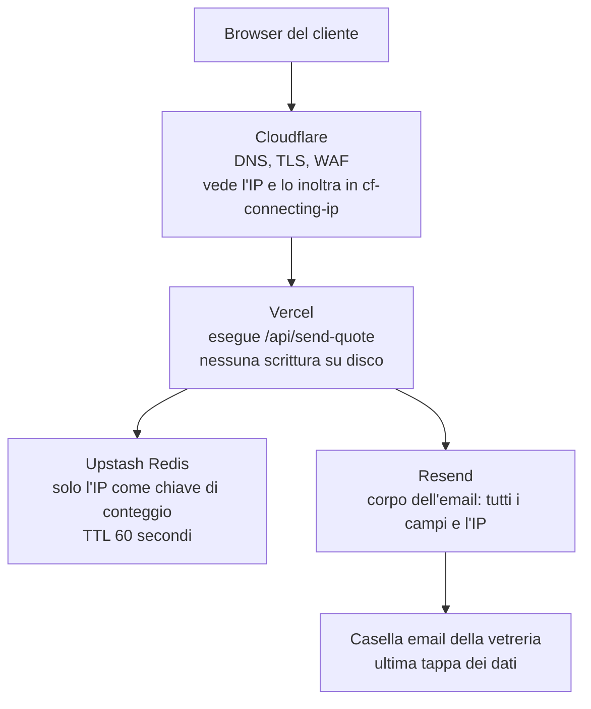

# Mappa dei dati

Perimetro: tutto ciò che il sito raccoglie, trasporta o conserva. La privacy policy pubblica dice le stesse cose in linguaggio non tecnico, qui ci sono i riferimenti al codice che permettono di verificarle.

## 1. L'unico punto di raccolta

Il sito ha una sola superficie di raccolta: il modulo di richiesta preventivo (`/preventivo`), servito da `POST /api/send-quote`. È l'unica route non prerenderizzata del sito, il resto è statico.

| Dato             | Da dove arriva                                    | Obbligatorio |
| ---------------- | ------------------------------------------------- | ------------ |
| Nome             | digitato dall'utente                              | sì           |
| Telefono         | digitato dall'utente                              | sì           |
| Email            | digitato dall'utente                              | sì           |
| Tipo di lavoro   | selezione da elenco chiuso                        | sì           |
| Descrizione      | digitato dall'utente, minimo 10 caratteri         | sì           |
| Misure           | digitato dall'utente, minimo 3 caratteri          | sì           |
| Consenso privacy | checkbox, mai pre-selezionata                     | sì           |
| Indirizzo IP     | header `cf-connecting-ip`, non chiesto all'utente | automatico   |

L'IP è ricavato in `src/pages/api/send-quote.ts` con una catena di fallback: `cf-connecting-ip`, poi `clientAddress`, poi `x-forwarded-for`, infine la stringa `unknown`. Dietro Cloudflare il primo è l'IP reale del visitatore e non è falsificabile sul percorso proxato.

## 2. Il percorso



Il rate-limit è in `src/lib/rate-limit.ts`: `slidingWindow(5, '60 s')` con prefisso `rl:quote`, quindi 5 richieste al minuto per IP. Se le variabili Upstash non sono configurate il limitatore ricade su un contatore in memoria, per istanza, e la cosa viene segnalata nei log come errore quando l'ambiente è production.

Il corpo dell'email è costruito da `src/lib/email-templates/quote-request.ts` e contiene nome, telefono, email, tipo di lavoro, descrizione, misure e IP. I dati passano prima da `sanitizeFormData` (`src/lib/sanitize.ts`), invocata in `src/lib/send-quote.ts`.

Il contenuto editoriale del sito arriva da Sanity e segue il percorso opposto: esce dal CMS verso il visitatore e non contiene dati di clienti.

## 3. Chi tocca cosa, e per quanto

| Fornitore         | Cosa vede                 | Dove                                                    | Per quanto                                   | Perché                        |
| ----------------- | ------------------------- | ------------------------------------------------------- | -------------------------------------------- | ----------------------------- |
| Cloudflare        | IP, metadati di richiesta | rete globale                                            | log di piattaforma, a breve termine          | DNS, TLS, WAF                 |
| Vercel            | il payload, in transito   | region impostata sul progetto (dashboard, non nel repo) | nulla di persistente: la funzione non scrive | esecuzione del modulo         |
| Upstash           | solo l'IP                 | AWS `eu-central-1` (Francoforte), resta in UE           | 60 secondi, scadenza automatica              | contare gli invii ravvicinati |
| Resend            | l'email completa          | USA, con SCC e Data Privacy Framework                   | secondo la sua retention di invio            | consegna dell'email           |
| Casella aziendale | l'email completa          | provider di posta                                       | 24 mesi dall'ultimo contatto                 | gestire il preventivo         |
| Sanity            | nessun dato di cliente    | CDN                                                     | non applicabile                              | contenuti del sito            |

La region Upstash è dichiarata anche ai visitatori, in `src/pages/privacy.astro`: è stata verificata in console il 2026-07-27 e spostare il database fuori dall'UE significherebbe correggere la privacy policy, non solo un'impostazione. La region Vercel invece è solo una configurazione di piattaforma, da verificare in dashboard: nel repo compaiono soltanto endpoint e token letti da variabili d'ambiente.

Non esiste un database applicativo. I dati del modulo esistono come email e nient'altro. L'unica eccezione è l'IP in Upstash, che scade da solo.

## 4. Cosa non viene fatto

Nessun analytics che profila. Vercel Speed Insights misura solo prestazioni, le statistiche di visita restano su Cloudflare in forma aggregata, Vercel Web Analytics non è installato.

Nessun dato di cliente verso l'agente SEO: quella pipeline ingerisce solo pagine web pubbliche.

Nessun addestramento di modelli sui dati raccolti, nessuna cessione o vendita a terzi.

## 5. Retention

| Dato                                    | Quanto resta                       | Come sparisce         |
| --------------------------------------- | ---------------------------------- | --------------------- |
| IP in Upstash                           | 60 secondi                         | TTL automatico        |
| Email nella casella aziendale           | 24 mesi dall'ultimo contatto       | cancellazione manuale |
| Log di piattaforma (Cloudflare, Vercel) | retention di default dei fornitori | automatica            |

La cancellazione a 24 mesi è manuale, non c'è un automatismo che la esegue. Il termine è scelto perché un preventivo su misura può essere ripreso a distanza di mesi. Una richiesta di cancellazione anticipata (art. 17 GDPR, punto 7 della privacy policy) viene evasa senza aspettare i 24 mesi.

Il valore dichiarato qui coincide con quello scritto in `src/pages/privacy.astro`.

## 6. Come ricontrollare che questa mappa sia ancora vera

```bash
# L'unica route dinamica: se l'elenco cresce, questa mappa va rifatta
grep -rln "prerender = false" src/pages/

# Dove finisce l'IP
grep -rn "cf-connecting-ip" src/

# Finestra e prefisso del rate limit
grep -n "slidingWindow\|prefix" src/lib/rate-limit.ts

# Chi riceve i dati del modulo
grep -rn "sanitizeFormData" src/
```

## 7. Riferimenti

- Privacy policy pubblica: [`/privacy`](https://vetreriamonferrina.com/privacy), punti 2, 5, 6
- Codice: `src/pages/api/send-quote.ts`, `src/lib/send-quote.ts`, `src/lib/rate-limit.ts`, `src/lib/sanitize.ts`, `src/lib/validation.ts`, `src/lib/email-templates/quote-request.ts`
