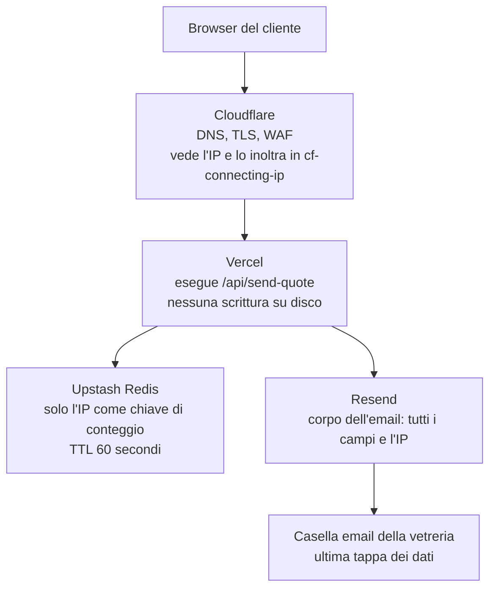

# Mappa dei dati

Perimetro: tutto ciò che il sito raccoglie, trasporta o conserva. La privacy policy pubblica dice le stesse cose in linguaggio non tecnico, qui ci sono i riferimenti al codice che permettono di verificarle.

## 1. L'unico punto di raccolta

Il sito ha una sola superficie di raccolta: il modulo di richiesta preventivo (`/preventivo`), servito da `POST /api/send-quote`. È l'unica route non prerenderizzata del sito, il resto è statico.

| Dato             | Da dove arriva                                    | Obbligatorio |
| ---------------- | ------------------------------------------------- | ------------ |
| Nome             | digitato dall'utente                              | sì           |
| Telefono         | digitato dall'utente                              | sì           |
| Email            | digitato dall'utente                              | sì           |
| Tipo di lavoro   | selezione da elenco chiuso                        | sì           |
| Descrizione      | digitato dall'utente, minimo 10 caratteri         | sì           |
| Misure           | digitato dall'utente, minimo 3 caratteri          | sì           |
| Consenso privacy | checkbox, mai pre-selezionata                     | sì           |
| Indirizzo IP     | header `cf-connecting-ip`, non chiesto all'utente | automatico   |

L'IP è ricavato in `src/pages/api/send-quote.ts` con una catena di fallback: `cf-connecting-ip`, poi `clientAddress`, poi `x-forwarded-for`, infine la stringa `unknown`. Dietro Cloudflare il primo è l'IP reale del visitatore e non è falsificabile sul percorso proxato.

## 2. Il percorso


```mermaid
flowchart TD
    A["Browser del cliente"] --> B["Cloudflare<br/>DNS, TLS, WAF<br/>vede l'IP e lo inoltra in cf-connecting-ip"]
    B --> C["Vercel<br/>esegue /api/send-quote<br/>nessuna scrittura su disco"]
    C --> D["Upstash Redis<br/>solo l'IP come chiave di conteggio<br/>TTL 60 secondi"]
    C --> E["Resend<br/>corpo dell'email: tutti i campi e l'IP"]
    E --> F["Casella email della vetreria<br/>ultima tappa dei dati"]
```

Il rate-limit è in `src/lib/rate-limit.ts`: `slidingWindow(5, '60 s')` con prefisso `rl:quote`, quindi 5 richieste al minuto per IP. Se le variabili Upstash non sono configurate il limitatore ricade su un contatore in memoria, per istanza, e la cosa viene segnalata nei log come errore quando l'ambiente è production.

Il corpo dell'email è costruito da `src/lib/email-templates/quote-request.ts` e contiene nome, telefono, email, tipo di lavoro, descrizione, misure e IP. I dati passano prima da `sanitizeFormData` (`src/lib/sanitize.ts`), invocata in `src/lib/send-quote.ts`.

## 3. Chi tocca cosa, e per quanto

| Fornitore            | Cosa vede                                                                                                                                                                                             | Dove                                                    | Per quanto                                                                           | Perché                                                                 |
| -------------------- | ----------------------------------------------------------------------------------------------------------------------------------------------------------------------------------------------------- | ------------------------------------------------------- | ------------------------------------------------------------------------------------ | ---------------------------------------------------------------------- |
| Cloudflare           | IP, metadati di richiesta                                                                                                                                                                             | rete globale                                            | log di piattaforma, a breve termine                                                  | DNS, TLS, WAF                                                          |
| Cloudflare Turnstile | segnali tecnici del browser su `/preventivo` (IP, impronta TLS, User-Agent, sitekey e origine, secondo il Privacy Addendum del 18/06/2025); il token, che la funzione inoltra a `siteverify` senza IP | rete globale                                            | non dichiarato dall'Addendum                                                         | distinguere un visitatore da un programma, prima dell'invio dell'email |
| Vercel               | il payload, in transito                                                                                                                                                                               | region impostata sul progetto (dashboard, non nel repo) | nulla di persistente: la funzione non scrive                                         | esecuzione del modulo                                                  |
| Upstash              | solo l'IP                                                                                                                                                                                             | AWS `eu-central-1` (Francoforte), resta in UE           | 60 secondi, scadenza automatica                                                      | contare gli invii ravvicinati                                          |
| Resend               | l'email completa                                                                                                                                                                                      | USA, con SCC e Data Privacy Framework                   | secondo la sua retention di invio                                                    | consegna dell'email                                                    |
| Casella aziendale    | l'email completa                                                                                                                                                                                      | provider di posta                                       | 24 mesi dall'ultimo contatto                                                         | gestire il preventivo                                                  |
| Sentry               | rapporto tecnico d'errore e paese della connessione, senza IP                                                                                                                                         | regione UE, Francoforte; SCC e DPF per i metadati USA   | fino a 90 giorni (30 sul piano gratuito)                                             | trovare i malfunzionamenti                                             |
| MET Norway           | nessun dato del visitatore: il browser chiama `/api/meteo` sul sito e la funzione Vercel chiede le previsioni per le coordinate fisse della vetreria                                                  | Norvegia (MET Norway, ente pubblico)                    | nessuno: MET riceve solo la richiesta del server del sito, nessun dato di chi visita | widget meteo                                                           |
| Google Maps (Embed)  | IP e metadati del browser, solo dopo il click "Visualizza la mappa" su `/contatti`                                                                                                                    | Google, privacy policy generale                         | secondo Google; la doc dell'Embed API non dice se l'iframe imposta cookie            | mappa interattiva                                                      |

La region Upstash è dichiarata anche ai visitatori, in `src/pages/privacy.astro`: è stata verificata in console il 2026-07-27 e spostare il database fuori dall'UE significherebbe correggere la privacy policy, non solo un'impostazione. La region Vercel invece è solo una configurazione di piattaforma, da verificare in dashboard: nel repo compaiono soltanto endpoint e token letti da variabili d'ambiente.

Turnstile non riceve i campi del modulo (doc: _"does not access, store, or transmit user communications, form entries, or other page inputs"_). Cloudflare è responsabile del trattamento per la protezione del sito e titolare per il miglioramento del servizio (Addendum §4). Se Turnstile imposti cookie o usi lo storage del browser l'Addendum non lo dice: la doc nomina solo il cookie di pre-clearance, che il sito non attiva. Misurato sulla preview l'08/10/2026 (Playwright, desktop e mobile, con la sitekey di test, dopo il token): nessun cookie, `localStorage` vuoto, in `sessionStorage` solo la chiave del chatbot. Con la chiave vera si rimisura in produzione dopo il merge.

Meteo: MET Norway al posto di Open-Meteo, la cui API gratuita è riservata all'uso non commerciale (#399). I dati MET sono sotto licenza NLOD 2.0 e CC BY 4.0 (https://api.met.no/doc/License), con attribuzione obbligatoria, che il widget mostra. I termini chiedono di non far chiamare l'API dai browser ma da un proxy (_"Browsers and mobile apps should not contact the API directly, but instead use a local proxy"_, https://api.met.no/doc/TermsOfService): per questo passa da `/api/meteo`, che tiene la risposta fino all'`Expires` di MET e manda a MET dominio ed email aziendale nell'User-Agent.

Non esiste un database applicativo. I dati del modulo esistono come email e nient'altro. L'unica eccezione è l'IP in Upstash, che scade da solo.

## 4. Cosa non viene fatto

Nessun analytics che profila. Vercel Speed Insights misura solo prestazioni, le statistiche di visita restano su Cloudflare in forma aggregata, Vercel Web Analytics non è installato.

Nessun dato di cliente verso l'agente SEO: quella pipeline ingerisce solo pagine web pubbliche.

Nessun addestramento di modelli sui dati raccolti, nessuna cessione o vendita a terzi.

## 5. Retention

| Dato                                    | Quanto resta                       | Come sparisce         |
| --------------------------------------- | ---------------------------------- | --------------------- |
| IP in Upstash                           | 60 secondi                         | TTL automatico        |
| Email nella casella aziendale           | 24 mesi dall'ultimo contatto       | cancellazione manuale |
| Log di piattaforma (Cloudflare, Vercel) | retention di default dei fornitori | automatica            |

La cancellazione a 24 mesi è manuale, non c'è un automatismo che la esegue. Il termine è scelto perché un preventivo su misura può essere ripreso a distanza di mesi. Una richiesta di cancellazione anticipata (art. 17 GDPR, punto 7 della privacy policy) viene evasa senza aspettare i 24 mesi.

Il valore dichiarato qui coincide con quello scritto in `src/pages/privacy.astro`.

## 6. Come ricontrollare che questa mappa sia ancora vera

```bash
# L'unica route dinamica: se l'elenco cresce, questa mappa va rifatta
grep -rln "prerender = false" src/pages/

# Dove finisce l'IP
grep -rn "cf-connecting-ip" src/

# Finestra e prefisso del rate limit
grep -n "slidingWindow\|prefix" src/lib/rate-limit.ts

# Chi riceve i dati del modulo
grep -rn "sanitizeFormData" src/
```

## 7. Riferimenti

- Privacy policy pubblica: [`/privacy`](https://vetreriamonferrina.com/privacy), punti 2, 5, 6
- Codice: `src/pages/api/send-quote.ts`, `src/lib/send-quote.ts`, `src/lib/rate-limit.ts`, `src/lib/sanitize.ts`, `src/lib/validation.ts`, `src/lib/email-templates/quote-request.ts`
