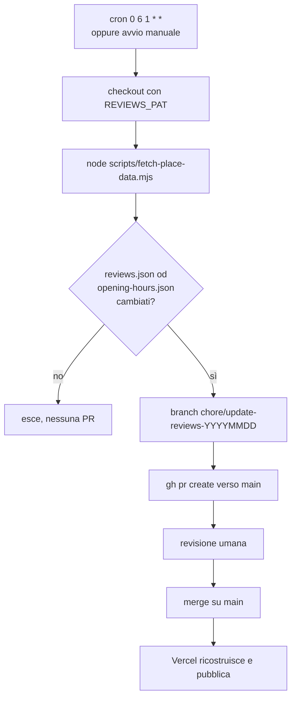

# Google Places, recensioni e orari

Recensioni e orari di apertura arrivano da Google Places API (New) e finiscono nel repo come JSON statico. Il sito non chiama Google a runtime: legge i file committati.

Il setup descritto nella sezione "Configurazione una tantum" è già stato fatto (progetto Google Cloud, chiave API, Place ID nei secret, workflow schedulato). Resta documentato per poterlo rifare o verificare, non è una lista di cose da fare.

## Lo script

Un solo script, `scripts/fetch-place-data.mjs`, una sola chiamata API.

| Voce                | Valore                                                                                              |
| ------------------- | --------------------------------------------------------------------------------------------------- |
| Variabili richieste | `GOOGLE_PLACES_API_KEY` e `GOOGLE_PLACE_ID`, entrambe obbligatorie                                  |
| Endpoint            | `GET https://places.googleapis.com/v1/places/{placeId}`                                             |
| Autenticazione      | header `X-Goog-Api-Key` e `X-Goog-FieldMask`                                                        |
| Campi richiesti     | `displayName`, `rating`, `userRatingCount`, `reviews`, `regularOpeningHours`, `currentOpeningHours` |
| Filtro recensioni   | rating maggiore o uguale a 4 e testo non vuoto (`MIN_RATING = 4`)                                   |
| File scritti        | `src/data/reviews.json` e `src/data/opening-hours.json`                                             |

Non scarica foto e non scrive altri file. Le foto Places sono state rimosse perché nessun componente le consumava e il cron ricommittava immagini morte a ogni run. In `.gitignore` resta la voce `src/data/place-photos.json`, residuo di quella versione.

I nomi degli autori sono abbreviati prima di essere scritti: "Mario Rossi" diventa "Mario R.". L'API restituisce al massimo 5 recensioni per richiesta, mentre rating complessivo e numero totale di recensioni sono sempre quelli aggiornati.

Lo script fallisce senza toccare i file se la risposta arriva senza `rating`, senza `userRatingCount` o senza `regularOpeningHours.periods`. Una risposta 200 ma vuota produrrebbe file plausibili e sbagliati, per esempio sette giorni "Chiuso", che il cron committerebbe.

## Esecuzione manuale

```bash
GOOGLE_PLACES_API_KEY=xxx GOOGLE_PLACE_ID=yyy node scripts/fetch-place-data.mjs
```

Output di un run riuscito:

```
Fetching place data from Places API (New)...
  Reviews: 3 positive (of 5 total)
  Hours: 3 time slots

Done! Rating: 4.4/5 (35 reviews)
```

Dopo il run si verificano i due JSON e si builda:

```bash
cat src/data/reviews.json
cat src/data/opening-hours.json
npm run build
```

## Aggiornamento automatico

Il workflow `.github/workflows/update-reviews.yml` gira con cron `0 6 1 * *`, quindi il primo giorno di ogni mese alle 6:00 UTC, ed è avviabile a mano con `workflow_dispatch`. Usa Node 22 e i secret `GOOGLE_PLACES_API_KEY`, `GOOGLE_PLACE_ID` e `REVIEWS_PAT`.

Non committa su `main`. Se i due JSON sono cambiati crea un branch `chore/update-reviews-YYYYMMDD`, lo pusha e apre una PR con `gh pr create` verso `main`. Il merge automatico non c'è di proposito, la PR resta aperta per revisione umana. Se i file sono identici il job esce senza fare nulla.



## Configurazione una tantum

Il progetto Google Cloud si crea da [Google Cloud Console](https://console.cloud.google.com/) con "Crea progetto", il nome è libero.

Le API da abilitare in "API e servizi", "Libreria" sono "Places API (New)", quella usata dallo script, e "Places API" legacy come riserva.

La chiave API si genera da "API e servizi", "Credenziali", "Crea credenziali", "Chiave API", e va limitata subito. In "Restrizioni API" si sceglie "Limita chiave" e si selezionano "Places API" e "Places API (New)". In "Restrizioni applicazione" si lascia "Nessuna", perché l'uso è server-side a build time e non c'è un referrer da dichiarare.

Il Place ID si trova col [Place ID Finder](https://developers.google.com/maps/documentation/places/web-service/place-id) cercando "Vetreria Monferrina Casale Monferrato", oppure l'indirizzo "Strada Statale 31, 98/C, Casale Monferrato". Ha formato `ChIJ...`, è un identificatore pubblico e viene ricopiato nel campo `placeId` di `reviews.json`.

I secret del repository si impostano in GitHub sotto Settings, Secrets and variables, Actions. Servono `GOOGLE_PLACES_API_KEY`, `GOOGLE_PLACE_ID` e `REVIEWS_PAT`, il token che apre la PR. Lo script fa `.trim()` su entrambe le variabili Google, perché uno spazio finale in un secret finisce nell'URL della richiesta e viene ricopiato nei JSON.

Quote e budget in Google Cloud limitano il danno di un uso accidentale o di un abuso.

| Impostazione           | Dove                          | Valore consigliato  |
| ---------------------- | ----------------------------- | ------------------- |
| Quota Places API (New) | IAM e amministrazione, Quote  | 50 richieste/giorno |
| Quota Places API       | IAM e amministrazione, Quote  | 50 richieste/giorno |
| Budget alert           | Fatturazione, Budget e avvisi | notifiche attive    |

Riferimento: https://docs.cloud.google.com/docs/quotas/view-manage

## Ruotare o revocare la chiave

Nella Google Cloud Console, sotto "API e servizi", "Credenziali", si crea una nuova chiave con le stesse restrizioni, si aggiorna il secret `GOOGLE_PLACES_API_KEY` su GitHub, si lancia il workflow a mano con `workflow_dispatch` per verificare che il run passi, e solo dopo si elimina la chiave vecchia. La chiave non compare mai nel browser, lo script gira solo in CI o in locale.

Se la chiave è stata esposta si elimina subito, senza aspettare la verifica. Senza chiave valida il workflow fallisce, ma il sito continua a servire i JSON già committati.

## Quando la PR mensile non arriva

Il caso più probabile è la scadenza di `REVIEWS_PAT`: il job fallisce al checkout o al `gh pr create` e non compare alcuna PR. Si rigenera il token con permessi di scrittura su contenuti e pull request, si aggiorna il secret e si rilancia il workflow a mano.

Se invece il job passa senza aprire PR, i dati Google non sono cambiati rispetto all'ultimo commit. È il comportamento previsto, non un errore.

Finché la PR non viene mergiata il sito resta sui dati precedenti, che restano validi. Non essendoci chiamate a Google a runtime, un workflow rotto non degrada le pagine pubbliche.

## Troubleshooting

| Messaggio o sintomo                                                                    | Causa e rimedio                                                                      |
| -------------------------------------------------------------------------------------- | ------------------------------------------------------------------------------------ |
| `Error: GOOGLE_PLACES_API_KEY and GOOGLE_PLACE_ID environment variables are required.` | Manca almeno una delle due variabili. Lo script non distingue quale.                 |
| `Google API returned <status>: <messaggio>`                                            | Errore HTTP da Google. Lo status e il messaggio dicono se è la chiave o il Place ID. |
| `Risposta Places senza rating/userRatingCount: run abortito, file non toccati.`        | Risposta 200 ma incompleta. Guardia dello script, i file restano quelli di prima.    |
| `Risposta Places senza regularOpeningHours.periods: run abortito.`                     | Come sopra, per gli orari.                                                           |
| `Reviews: 0 positive`                                                                  | Nessuna recensione da 4 stelle in su con testo, oppure nessuna recensione.           |
| Il sito non si aggiorna                                                                | La PR mensile va mergiata: è il merge su `main` a far ripartire la build su Vercel.  |

## Sicurezza

La chiave API non va mai committata: variabili d'ambiente in locale, GitHub Secrets in CI. Le restrizioni sulla chiave sono limitate a Places API e Places API (New).

Lo script gira solo server-side, a build time o in CI, quindi la chiave non finisce mai nel browser. I file JSON committati contengono solo dati già pubblici su Google: rating, nome abbreviato dell'autore, data, testo della recensione e orari.

Se in futuro si userà Google Maps JavaScript lato client, quella chiave sarà esposta e andrà protetta con Firebase App Check. Riferimento: https://developers.google.com/maps/documentation/javascript/places-app-check
